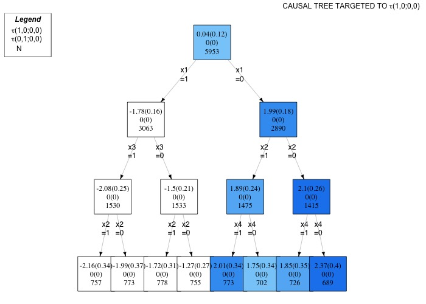

# Summary

@cox1958planning asserts that interference occurs when the assignment of treatment to one unit influences the outcomes of other units. In the realm of policy interventions, interference can manifest through various interactions, encompassing social, physical, or virtual connections. The conventional Rubin Causal Model, employed in causal inference studies [@rubin1986comment], excludes interference. However, when interference plays a role, it introduces bias into estimates [@forastiere2016identification]. Additionally, spillover effects enable researchers to gauge the overall impact of an intervention and to enhance the efficiency of treatment assignment mechanisms. Consequently, recent research has devised inventive methodologies to tackle interference [@sobel2006randomized; @rosenbaum2007interference].
Concurrently, alongside the interference research domain, scholars have crafted machine learning algorithms to appraise treatment effects' heterogeneity with respect of individual characteristics [@athey2016recursive]. The rationale behind these algorithms lies in partitioning sub-populations by iteratively segregating groups whose estimated average treatment effect exhibits the most deviation.

To integrate the aforementioned two topics in the field of causal inference through [@bargagli2020heterogeneous] introduces a novel machine learning algorithm, named Network Causal Tree (NCT), that explores the heterogeneity of treatment and spillover effects concerning individual, neighborhood, and network characteristics within randomized settings. NCT is designed to operate amidst clustered network interference (CNI), where agents are categorized into distinct clusters, and spillover mechanisms exclusively take place within clusters based on the links of a cluster-specific network. The estimation of conditional effects is carried out using an extended version of the Horvitz-Thompson estimator [@aronow2017estimating], tailored to accommodate clustered network interference. `NetworkCausalTree` is an R Package providing a flexible implementation of the Network Causal Tree algorithm.


# Algorithm

The NCT algorithm is designed to detect and estimate heterogeneous treatment and spillover effects in randomized settings, under CNI. Under CNI, spillover is confined to units within the same cluster, and an individual's outcome is influenced by the treatment status of directly connected units in the cluster-specific network. Potential outcomes are indexed with respect to the individual intervention $W_{ik}$ (where $k\in \mathcal{K}=[1, \ldots, K]$ is the cluster indicator, and $i=1,\ldots, n_k$ is the unit indicator in each cluster $k$.) and to the neighborhood treatment $G_{ik}$, which is defined as a binary variable that equals 1 if the unit $ik$ has at least one treated neighbor, 0 otherwise. Estimands of interest ($\tau_{(w,g;w',g')}$) encompass two treatment and two spillover effects, comparing average potential outcomes under varying individual or neighborhood treatment statuses, while keeping the other constant

`NetworkCausalTree` relies on a flexible in-sample splitting criterion function that can potentially accommodate for more than one estimand simultaneously. `NetworkCausalTree` procedure is divided into two steps, discovery and estimation, and each cluster is randomly assigned to one of the two clusters(honest splitting). In the discovery step, `NetworkCausalTree` builds a tree according to the in-sample splitting criterion and stops when either the tree has reached its maximum depth or any additional split would generate leaves, which are not sufficiently representative of the four exposure conditions. In the estimation step, `NetworkCausalTree` estimates the CACEs and their standard errors in each leaf.


# Usage

`NetworkCausalTree` is available on [GitHub](https://github.com/fbargaglistoffi/NetworkCausalTree) and can be installed and loaded into the R session
using:


```r
library(devtools)
install_github("fbargaglistoffi/NetworkCausalTree", ref="master")
```

`data_generator()` is a flexible synthetic dataset generator, which can be used for simulations before applying `NetworkCausalTree` to real-world  data sets. It returns a CNI environment, where cluster-specific networks are generated either using the Erdos-Renyi model, the Barabasi-Albert or the Exponential Random Graph Model, that can potentially account for homophily.

```r
dataset <- data_generator(N = 4000, 
                          K = 4,
                          m = 80, 
                          p = rep(0.2,4000), 
                          het = TRUE, 
                          h = 2, 
                          method_networks = "er", 
                          param_er = 0.1)
```

We propose here two examples of how to run the Network Causal Tree algorithm by the `NetworkCausalTree` package.


**Example 1.** Running Network Causal Tree while relying on a singular in-sample splitting criterion function, that assesses the heterogeneity of the main treatment effect ($\tau_{(1,0;0,0)}$)  only 


```r
result <- NetworkCausalTree(X = dataset[["X"]],
                            Y = dataset[["Y"]],
                            W = dataset[["W"]], 
                            A = dataset[["A"]],
                            M = dataset[["M"]],
                            p = dataset[["p"]], 
                            effect_weights = c(1,0,0,0),
                            ratio_dis = 0.5,
                            depth = 3,
                            minsize = 5, 
                            method = "singular",
                            output = "estimation")

```

**Example 2.** Running Network Causal Tree while relying on a composite in-sample splitting criterion function, which accounts for all the four estimands simultaneously 

```r
result <- NetworkCausalTree(X = dataset[["X"]],
                            Y = dataset[["Y"]],
                            W = dataset[["W"]], 
                            A = dataset[["A"]],
                            M = dataset[["M"]],
                            p = dataset[["p"]], 
                            effect_weights = c(0.25,0.25,0.25,0.25),
                            ratio_dis = 0.5,
                            depth = 3,
                            minsize = 5, 
                            method = "composite",
                            output = "estimation")
```


The results are included in a  `data.frame` object which provides information about i) the partitions identified by the tree ii) the number of units included in all partitions, iii) the estimated CACEs, with their corresponding standard errors, in all leafs. The function `print()` displays these results and the `plot_NCT()` function visualizes results. For instance, the plot related to the `NetworkCausalTree` resulted in the **Example 1** is obtained using: 


```r
title <- expression(paste("CAUSAL TREE TARGETED TO ",tau,"(1,0;0,0)"),sep="")
cov_names <- colnames(dataset[["X"]])

plot_NCT(NCT = result, 
         cov_names = cov_names,
         title = title)
```

Figure 1 reports the visualization of the results for Example 1, which perfectly discover the correct CATE decomposition.



Online documentation for the package can be found at [https://github.com/fbargaglistoffi/NetworkCausalTree](https://github.com/fbargaglistoffi/NetworkCausalTree).

# Acknowledgements

We acknowledge ...

# References
