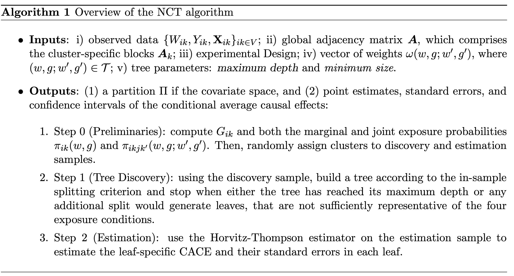
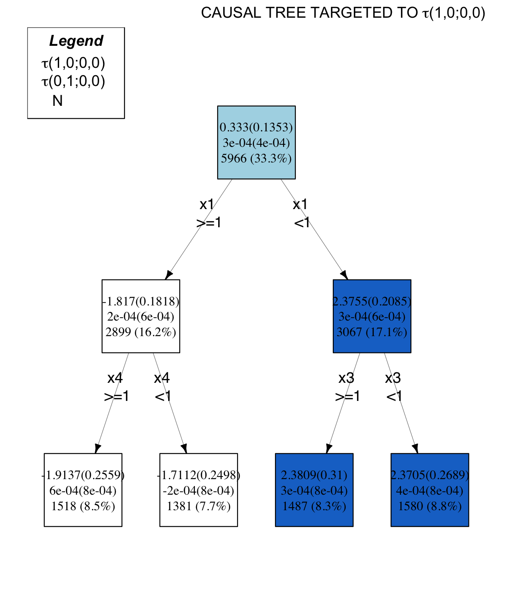
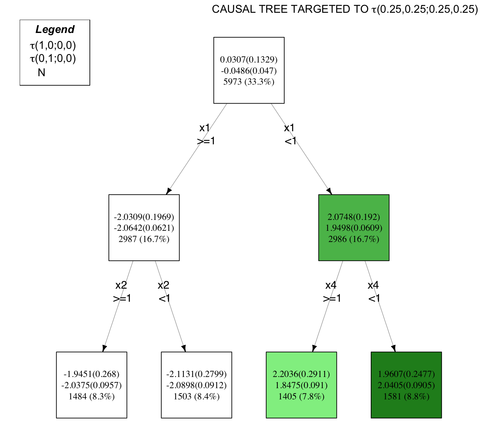

# Summary

Interference occurs when treatment assigned to one unit influences the outcomes of other units [@cox1958planning]. In the realm of policy interventions, interference can manifest through various interactions, encompassing social, physical, or virtual connections. The conventional Rubin Causal Model, employed in causal inference studies [@rubin1986comment], excludes interference. However, when interference is present, it must be taken into account to prevent a biased estimation of the treatment effect [@forastiere2016identification] and to be able to estimate spillover effects, that is, the effects on a unit's outcome of the treatment received by other units. Consequently, recent research has devised new methodologies to tackle interference on networks [@forastiere2016identification; @aronow2017estimating; @athey2018exact; @leung2020treatment]. Concurrently, alongside the interference research domain, scholars have crafted machine learning algorithms to appraise treatment effect heterogeneity with respect to individual characteristics [@athey2016recursive]. These algorithms identify heterogeneous sub-populations by iteratively segregating groups whose estimate conditional average treatment effect differs the most from others, and enabling researchers to understand which sub-populations are particularly responsive to the treatment.

To integrate the aforementioned two topics in the field of causal inference, @bargagli2024heterogeneous introduces a novel machine learning algorithm, named Network Causal Tree (NCT), that explores the heterogeneity of treatment and spillover effects concerning individual, neighborhood, and network characteristics within randomized settings. Evaluating the heterogeneity of treatment and spillover effect is crucial for identifying both those sub-populations who are responsive to the treatment they received and those who are highly susceptible to the treatment received by other units. Heterogeneity exploration is performed via an interpretable decision tree algorithm. Decision trees provide high levels of interpretability by offering transparent insights into the relationships in the data that are learned by the model [@murdoch2019definitions]. By recursively partitioning the data via decision rules, decision trees transform complex data patterns into an intelligible series of *if-then* decision rules. NCT is designed to operate within clustered neighborhood interference (CNI), where units are partitioned into distinct clusters, spillover mechanisms exclusively take place within clusters based on the links of a cluster-specific network and units are assumed to receive an indirect exposure to the intervention if they have at least one treated peer within their immediate neighbors. The estimation of conditional effects is carried out using an extended version of the Horvitz-Thompson estimator [@aronow2017estimating], tailored to accommodate clustered network interference. `NetworkCausalTree` is an R Package providing a flexible implementation of the Network Causal Tree algorithm.

This paper introduces the `NetworkCausalTree` R package, the first open-source implementation of a decision-tree method for estimating heterogeneous treatment and spillover effects under clustered network interference. All analyses and figures in this paper can be reproduced using the scripts and example data provided in the package’s GitHub repository.

# Statement of need

Existing R packages and algorithms are designed either to detect and estimate Heterogeneous Treatment Effects (HTEs) in the absence of interference or to estimate average causal effects in the presence of interference.

On the one hand, there are a plethora of methods to discover and estimate HTEs employing decision trees in the absence of interference. Some of them have also been implemented in R. For instance: i) the `aVirtualTwins` package, which implements the Virtual Twins algorithm introduced by [@foster2011subgroup]; ii) the `causalTree` package, which implements the Causal Honest Tree algorithm introduced by Athey and Imbens [@athey2016recursive]; iii) the `policytree` which implements the Policy Tree methodology as proposed by [@athey2021policy]; iv) the `CRE` package [@Cadei2023], which implements the Causal Rule Ensemble algorithm introduced by [@bargagli2020causal].

On the other hand, there are three main packages to estimate average causal effects in the presence of interference: i) the `inferference` package implements the inverse probability weighting estimator proposed by @tchetgen2012causal to evaluate the causal effect of an intervention in the presence of partial interference in observational studies; ii) the `interference` package estimates causal effects under network interference in randomized experiments [@aronow2017estimating]; iii) the `inferference` `latenetwork` package estimates the causal effect of an intervention under noncompliance and unknown network interference.

Existing methods for causal inference either handle treatment effect heterogeneity *without interference* or interference *without heterogeneity*. The table below summarizes this gap:

| Package | Handles Interference | Handles Heterogeneity | Network Structure |
|------------------|------------------|------------------|------------------|
| `aVirtualTwins` [@foster2011subgroup] | ✗ | ✓ | ✗ |
| `causalTree` [@athey2016recursive] | ✗ | ✓ | ✗ |
| `policytree` [@athey2021policy] | ✗ | ✓ | ✗ |
| `CRE` [@bargagli2020causal] | ✗ | ✓ | ✗ |
| `interference` [@aronow2017estimating] | ✓ | ✗ | ✓ |
| `inferference` [@tchetgen2012causal] | ✓ | ✗ | ✓ |
| **`NetworkCausalTree` (ours)** | **✓** | **✓** | **✓** |

NetworkCausalTree fills this hole by providing the first interpretable, decision-tree-based approach for discovering heterogeneity in both treatment and spillover effects under network interference.

To account for the current lack of existing methods for a data-driven discovery of the heterogeneity of causal effects in the presence of network interference, we propose `NetworkCausalTree`, an R package providing a flexible implementation of the Network Causal Tree algorithm. `NetworkCausalTree` provides i) an interpretable representation of the heterogeneity of treatment and spillover effects in the presence of CNI, within randomized settings; ii) the possibility for the researcher to simultaneously model the heterogeneity of both treatment and spillover effects. To the best of our knowledge, there aren't existing packages to explore, in a data-driven manner, the heterogeneity of treatment and spillover effects in the presence of network interference.

# Algorithm

The NCT algorithm is designed to detect and estimate heterogeneous treatment and spillover effects in randomized settings under CNI. Under CNI, spillover is confined to units within the same cluster, and an individual's outcome is influenced by the treatment status of directly connected units in the cluster-specific network. Potential outcomes $Y_{ik}(w,g)$---where $k\in \mathcal{K}=[1, \ldots, K]$ is the cluster indicator, and $i=1,\ldots, n_k$ is the unit indicator in each cluster $k$---are indexed with respect to the individual treatment $W_{ik} = w$ and to the neighborhood treatment $G_{ik} = g$, which is defined as a binary variable that equals 1 if the unit $ik$ has at least one treated neighbor, 0 otherwise. For each observation $ik$ in the sample $\mathcal{V}$ we observe the cluster indicator $M_{ik}$ and a vector of individual or network characteristics $\mathbf{X_{ik}}$. The adjacency matrix describing interactions between units within a given cluster $k$ is denoted with $\mathbf{A_{k}}$. Estimands of interest $\tau_{(w,g;w',g')}$ encompass two treatment and two spillover effects, comparing average potential outcomes under varying individual or neighborhood treatment statuses, while keeping the other constant. For the subset of units with covariate vectors $\mathbf{x} \in \mathcal{X}$ that are mapped in the leaf $l(\mathbf{x})$, we define the leaf-specific conditional average causal effect (CACE) comparing the treatment status $(w,g)$ and the one $(w',g')$ as follows:

%7D(l(\mathbf%7Bx%7D))=\frac%7B1%7D%7BN(l(\mathbf%7Bx%7D))%7D\sum_%7Bk=1%7D%5E%7BK%7D\sum_%7Bi=1%7D%5E%7Bn_k%7DY_%7Bik%7D(w,g)I(\mathbf%7BX_%7Bik%7D%7D\in%20l(\mathbf%7Bx%7D))-\frac%7B1%7D%7BN(l(\mathbf%7Bx%7D))%7D\sum_%7Bk=1%7D%5E%7BK%7D\sum_%7Bi=1%7D%5E%7Bn_k%7DY_%7Bik%7D(w',g')I(\mathbf%7BX_%7Bik%7D%7D\in%20l(\mathbf%7Bx%7D)))

where $N(l(\mathbf{x}))$ is the number of units within the leaf $l(\mathbf{x})$.

These effects will be estimated by a Horvits-Thompson estimator [@bargagli2024heterogeneous], which employs both the marginal probability of an individual $ik$ to be exposed to the treatment level $(w,g)$ $\pi_{ik}(w,g)$ and the joint probability of two individuals $ik$ and $jk'$ to be simultaneously exposed to the treatment levels $(w,g)$ and $(w',g')$, respectively, $\pi_{ikjk'}(w,g;w',g')$.

`NetworkCausalTree` relies on a flexible in-sample splitting criterion function that can potentially accommodate more than one causal estimand simultaneously: researchers rule the extent of which the four estimands contribute to the objective function used to partition the covariate space by assigning customized weights, included in the vector $\omega(w,g;w',g')$ . `NetworkCausalTree` procedure is divided into two steps: discovery and estimation. Each cluster is randomly assigned to either the discovery or the estimation set (using a procedure that is commonly referred to as *honest splitting*). In the discovery step, `NetworkCausalTree` builds a tree according to the in-sample splitting criterion and stops when either the tree has reached its maximum depth or any additional split would generate leaves that are not sufficiently representative of the four exposure conditions. In the estimation step, `NetworkCausalTree` estimates the CACEs and their standard errors in each leaf. The steps of the `NetworkCausalTree` algorithm are illustrated in the Algorithm 1 table.



*Figure 1. Image of the Network Causal Tree algorithm. Adapted from Bargagli-Stoffi et al. (2024), "Heterogeneous Treatment and Spillover Effects under Network Interference."*

# Usage

`NetworkCausalTree` is available on [GitHub](https://github.com/fbargaglistoffi/NetworkCausalTree) and can be installed and loaded into the R session using:

``` r
library(devtools)
install_github("fbargaglistoffi/NetworkCausalTree", ref="master")
```

`data_generator()` is a flexible synthetic dataset generator, which can be used for simulations before applying `NetworkCausalTree` to real-world data sets. It returns a CNI environment, where cluster-specific networks are generated either using the Erdos-Renyi model [@erdos1959random], the Barabasi-Albert [@barabasi1999emergence], or the exponential random graph model [@lusher2013exponential]. To generate synthetic data, the user has to specify the sample size (`N`), the number of clusters (`m`), the number of covariates (`K`), the vector collecting individual treatment assignment probabilities (`p`), the simulated size of the main treatment effect $\tau_{(1,0;0,0)}$ (`h`), the parameter that specifies whether treatment heterogeneity is present in the data (`het`) (if this parameter is TRUE the function introduces treatment heterogeneity with respect to the first regressor in the dataset such that $\tau_{(1,0;0,0)}  = h$ if $x1=0$ and $\tau_{(1,0;0,0)}  = - h$ if $x1 = 1$ , the method employed to generate the cluster-specific networks (`method_networks`), and its required parameters---here, since networks are generated according to the Erdos-Renyi model (`method_networks = er`)---, parameters are specified using `param_er` the option.

The `data_generator()` function returns as output a list of synthetic data including the covariates matrix (`X`), the outcome vector (`Y`), the individual intervention vector (`W`), the adjacency matrix (`A`), the neighborhood intervention vector (`G`), the group membership vector (`K`) and the vector describing the probability to be assigned to the active individual intervention vector (`p`).

``` r
dataset <- data_generator(N = 4000, 
                          M = 4,
                          k = 80, 
                          p = rep(0.2,4000), 
                          het = TRUE, 
                          h = 2, 
                          method_networks = "er", 
                          param_er = 0.1)
```

We propose here two examples of how to run the Network Causal Tree algorithm by the `NetworkCausalTree` package. To run the `NetworkCausalTree` function, the user has to input the following arguments: the data (`W`,`Y`,`X`,`M`) = $(W_{ik}, Y_{ik}, \mathbf{X_{ik}}, M_{ik})$, where $ik \in \mathcal{V}$; the vector collecting individual treatment assignment probabilities `p`, the global adjacency matrix `A` that includes the cluster specific matrices $\mathbf{A_{k}}$. Moreover, users must specify the weights vector $\omega(w,g;w',g')$, ruling the extent of which each causal estimands contribute to the objective function (`effect_weights`); the `ratio_disc` parameter, representing the ratio of clusters to be included in the discovery set only; two parameters ruling the stopping criteria of the tree (`depth` measures the maximum depth, while `minsize` specifies the minimum number of observations for each level of the joint treatment $(w,g)$ to be required in the leafs; the method to compute the objective function, that is, `method = "singular"` for NCT targeted to one single effect, `method = "composite"` for NCT targeted to multiple effects, `method = "penalized"` for a criterion function computed while considering a single effect only and including a penalization term related to the variance within the leafs; the desired `output` of the function ( if `output = "detection"` only point estimates are computed, if `output = "estimation"` both estimated effects and their standard errors are computed).

**Example 1.** Running Network Causal Tree while relying on a singular in-sample splitting criterion function, that assesses the heterogeneity of the main treatment effect ($\tau_{(1,0;0,0)}$) only

``` r
result <- NetworkCausalTree(X = dataset[["X"]],
                            Y = dataset[["Y"]],
                            W = dataset[["W"]], 
                            A = dataset[["A"]],
                            K = dataset[["K"]],
                            p = dataset[["p"]], 
                            effect_weights = c(1,0,0,0),
                            ratio_disc = 0.5,
                            depth = 3,
                            minsize = 5, 
                            method = "singular",
                            output = "estimation")
```

**Example 2.** Running Network Causal Tree while relying on a composite in-sample splitting criterion function, which accounts for all the four estimands simultaneously

``` r
result <- NetworkCausalTree(X = dataset[["X"]],
                            Y = dataset[["Y"]],
                            W = dataset[["W"]], 
                            A = dataset[["A"]],
                            K = dataset[["K"]],
                            p = dataset[["p"]], 
                            effect_weights = c(0.25,0.25,0.25,0.25),
                            ratio_disc = 0.5,
                            depth = 3,
                            minsize = 5, 
                            method = "composite",
                            output = "estimation")
```

The results are included in a `data.frame` object which provides information about i) the nodes identified by the tree (`FILTER`), and their role in the tree - parent or leaf - (`TERMINAL`), ii) the number of units included in all nodes, both in the discovery set (`NOBS_TR`) and in the estimation set (`NOBS_EST`), iii) the estimated CACE's (`EFF(w,g;w',g')_EST`), with their corresponding standard errors (`SE(w,g;w',g')_EST`), in all nodes. The function `print()` displays these results and the `plot_NCT()` function visualizes the tree with the estimated effects in each leaf. In each node, we display, from top to bottom, the estimates of the main treatment effect, $\tau(1,0;0,0)$ and of the main spillover effect, $\tau(0,1;0,0)$, and the size of the selected subpopulations. The colors indicate the sign and magnitude of either the main treatment effect, $\tau(1,0;0,0)$, or the main spillover effect, $\tau(0,1;0,0)$. Blue nodes correspond to positive estimated treatment effects, while green nodes represent positive estimated spillover effects. The intensity of the color indicates the strength of the effect: darker shades correspond to stronger effects, and negative effects are shown in white.

For instance, Figure 1 shows the tree obtained from **Example 1**. The code used to produce the plot is as follows:

``` r
title <- expression(paste("CAUSAL TREE TARGETED TO ",tau,"(1,0;0,0)"),sep="")
cov_names <- colnames(dataset[["X"]])

plot_NCT(NCT = result, 
         cov_names = cov_names,
         title = title)
```



Figure 2 shows the tree obtained from **Example 2**.

``` r
title <- expression(paste("CAUSAL TREE TARGETED TO ",tau,"(0.25,0.25;0.25,0.25)"),sep="")
cov_names <- colnames(dataset[["X"]])

plot_NCT(NCT = result, 
         cov_names = cov_names,
         title = title)
```



In this example, the most important heterogeneity driver is `x1`. The estimated main treatment effect is strongly positive and close to 2 if if $x1 = 0$, while it is strongly negative and close to -2 for $x1 = 1$ (note that this result is coherent with respect to the previous definition of the parameters related to the `data_generator()` function, `h = 2` and `het = TRUE`)

Online documentation for the package can be found at [fbargaglistoffi/NetworkCausalTree](https://github.com/fbargaglistoffi/NetworkCausalTree).

# Reproducibility and dependencies

All examples in this paper can be reproduced using the scripts provided in the `tests/examples/` directory of the package’s GitHub repository. The package relies solely on standard R libraries, which are automatically installed and loaded upon installation of `NetworkCausalTree`. Numerical stability and reproducibility have been validated through extensive simulation studies and example analyses across multiple systems. **The package passes all standard R CMD check tests without errors or warnings, confirming full compliance with CRAN submission standards.**

# Implementation and future work

This package is implemented in R and follows standard R development conventions, ensuring compatibility across systems. The GitHub repository provides detailed vignettes and example scripts to facilitate reproducibility. Community engagement is encouraged through documented contribution guidelines ([`CONTRIBUTING.md`](https://github.com/charliewang123/NetworkCausalTree/blob/master/CODE_OF_CONDUCT.md)) and a code of conduct ([`CODE_OF_CONDUCT.md`](https://github.com/charliewang123/NetworkCausalTree/blob/master/CODE_OF_CONDUCT.md)). Users can report issues or request support through the GitHub Issues page.

Future extensions will include support for continuous exposures (e.g., multiple dosage levels of a vaccine), integration with random forest estimators for ensemble-based causal discovery (similar to how grf builds on causalTree), and diagnostic tools for sensitivity analysis under partial interference (e.g., assessing whether the CNI assumption is reasonable given the data).

# Acknowledgements

This work was supported by the Alfred P. Sloan Foundation Grant G-2020-13946 for the development of *Causal Inference with Complex Treatment Regimes: Design, Identification, Estimation, and Heterogeneity* and the Harvard Data Science Initiative Postdoctoral Research Fund Award.

# References
